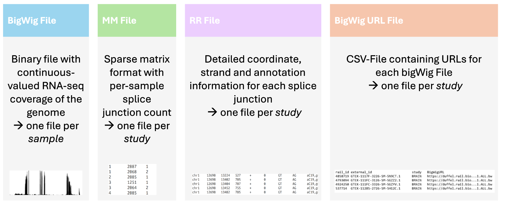
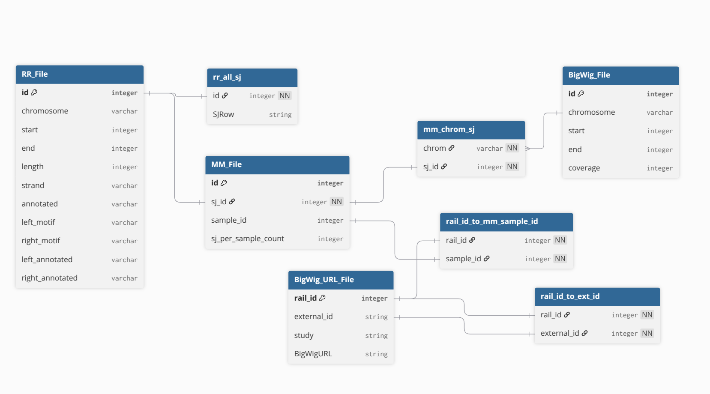
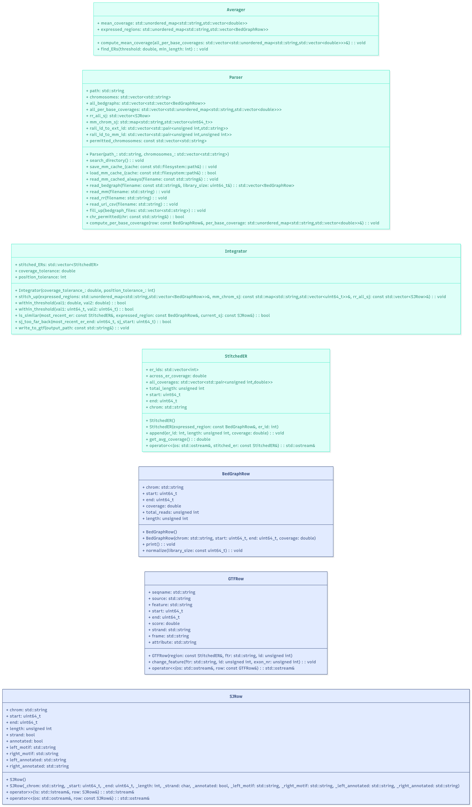
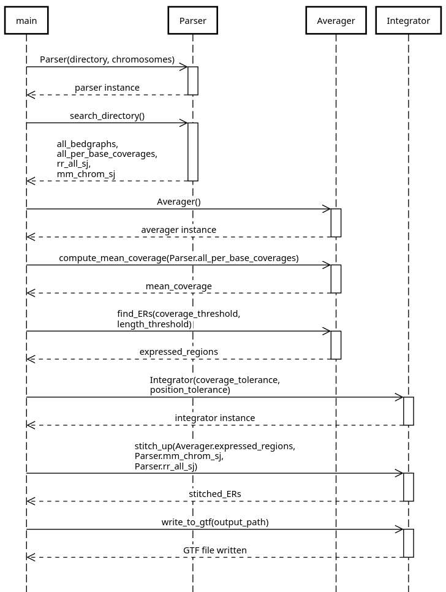

# _fastder_  
`fastder` is a C++ based tool for detecting expressed regions in RNA-seq data. 
It is intended to build on the `recount3` [resource](https://rna.recount.bio/), which consists of over 750'000 uniformly processed RNA-seq samples across different mouse and human studies.
The tool aims to reconstruct expressed genes prior to splicing in an annotation-agnostic approach.

`fastder` takes genome-wide coverage bigWig files and splice junction coordinates as an input. The tool averages across samples and performs thresholding to identify 
consecutive regions with above-threshold expression. Following this, `fastder` attempts to stitch together expressed regions (ERs)
by searching for splice junction coordinates that overlap with the start and end position of these expressed regions. 


## Installation

### Recount3 Background
`recount3` provides RNA-seq data for over 8'000 human and over 10'000 mouse studies. Each study consist of multiple _per-sample_ 
coverage bigWig files and one set of *per-study* splice junction coordinate files amongst others.
These datasets can be downloaded from their [online platform](https://jhubiostatistics.shinyapps.io/recount3-study-explorer/). 
Thus, the user can either provide data from one of the existing studies or run the `recount3` pipeline with new RNA-seq data.


## Input data

`recount3` provides uniformly processed RNA-seq data for over 8'000 human and over 10'000 mouse studies. Each study consists of several thousand samples. Existing input files can be retrieved from the [recount3 online platform](https://jhubiostatistics.shinyapps.io/recount3-study-explorer/).
If a user wishes to run `fastder` on new RNA-seq data, the easiest way to obtain the required input data is to run the `recount3` pipeline.




### Recount3 Pipeline
`fastder` builds on
A brief summary of the relevant steps in the `Monorail` system (used to create `recount3` resources) is provided below:

1. Input data: 
   1. unpaired or paired-end FASTQ files
   2. suffix-array-based index of reference genome sequence

2. Perform spliced alignment with STAR to obtain 
   1. a BAM file with the spliced alignment
   2. a summary of detected splice junction

3. Use Megadepth to produce _bigWig coverage files_
4. Aggregate SJ.out.tab into a
   1. _MM file_
   2. _RR file_

## Code Structure

### Relational Database Model
The following image provides an overview of the tables and objects used in `fastder`. The _File suffix indicates that the table is one of the input files. 
All other tables are objects created by the `Parser` class to map between the IDs used by the different tables.



### UML Diagram
`fastder` is comprised of 7 different classes. The blue classes are used to define custom data types and associated methods, 
whereas the green classes are wrappers for the three main functional stages of `fastder`.



### Sequence Diagram
The following sequence diagram provides an abstracted overview of the main stages of `fastder`.


## Usage

`fastder` can currently take only one RR and MM file as an input. Thus, users directly working with
`recount3` resources can only provide samples from the same study as an input. 

- `fastder` expects all input files to be in the same folder (provided as a relative path to the build directory with `--dir`). 
- `fastder` allows users to optionally specify which chromosomes they wish to analyze. The flag `--chr <chr1>` means 
that the tool will only output expressed regions on chromosome 1, and will ignore all coverage and splice junction information from other chromosomes). 
- `fastder` allows optionally specifying four different thresholds:
  -  `--min-coverage 0.25` describes the coverage threshold of an expressed region (ER). 
  A consecutive base-pair position must have at least 0.25 CPM coverage to be added to en ER.
  - `--min-length 5` describes the minimum length (in bp) that an ER must have. For instance, three consecutive base pairs with coverage > 0.25 CPM will be ignored if the min length is set to 5 bp.
  - `--position-tolerance 5` describes the maximum permitted offset of the end position of an exon and the starting position of a splice junction. If this tolerance is set to 5,
  an ER with end position = 1000 bp and a splice junction with start position = 1005 bp will be stitched together (if the coverage and end junction match).
  - `--coverage-tolerance 0.1` describes the maximum permitted coverage deviation between two ER that are separated by a spliced region. For a coverage tolerance of 0.1, 
  two ERs with coverage = 10 CPM and 11 CPM will be stitched together (if there is a matching splice junction).
```
Usage:
   fastder \
      --dir <path> ... \
      [--chr <chr1> <chr2> ...] \
      [--min-coverage <float>] \
      [--position-tolerance <int>] \
      [--coverage-tolerance <float>] \
      [--help]

Required inputs:

   --dir <path> ...                             Relative path from the build directory to the directory containing the input files.
                                                Example: --dir ../../data/test_exon_skipping

Optional inputs:

   --chr <chr1> <chr2> ...                      List of chromosomes to process.
                                                Default: all (chr1-chr22, chrX)
                                                Example: --chr chr1 chr2 chr3
                                                
   --min-length <float>                         Minimum length [#bp] required for a region to qualify as an expressed region (ER).
                                                Default: 5 bp
                                                Example: --min-length 5
                                                
   --min-coverage <float>                       Minimum coverage [CPM] required for a region to qualify as an ER.
                                                Normalized in-place by library size.
                                                Default: 0.25 CPM
                                                Example: --min-coverage 0.25
   
   --position-tolerance <int>                   Maximum allowed positional deviation between splice junction and ER coordinates [bp].
                                                Default: 5 bp
                                                Example: --position-tolerance 5
   
   --coverage-tolerance <float>                 Allowed relative deviation in coverage between stitched ERs (e.g. 0.1 = 10%).
                                                Default: 0.1
                                                Example: --coverage-tolerance 0.1
   
   --help                                       Show this help message.
   

Example:
   
   fastder \
   --dir ../../data/input \
   --chr chr1 chr2 \
   --position-tolerance 5 \
   --min-length 5 \
   --min-coverage 0.25 \
   --coverage-tolerance 0.1
```


## License

GPLv3

## Contact

martina.lavanya@gmail.com

## Acknowledgements